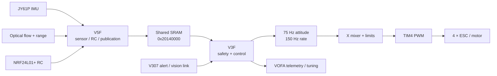

# CH32H417 Dual-Core Quadrotor Flight Controller

基于 WCH CH32H417 V5F/V3F 的**双核裸机四旋翼飞控原型**：V5F 负责传感器与遥控链路，V3F 在固定定时节拍中完成安全门控、级联控制、混控和四路 ESC PWM。



- **Dual-core bare-metal architecture** — 没有 RTOS；中断 + main loop + 固定定时器分频。
- **Shared SRAM communication** — 两核共享固定 ABI；TOF 路径单独使用 commit marker、memory fence 和读侧双检。
- **Multi-rate control** — 源码配置 150 Hz rate、75 Hz attitude、50/25 Hz flow/height 分频任务。
- **Non-blocking telemetry** — VOFA TX 使用中断驱动 ring buffer，队列不足时记录丢帧而不等待串口。
- **Safety gates and diagnostics** — armed gate、RC timeout、告警停机、角速度保护、输出限幅/slew 和运行统计。

> **验证边界：**作者确认比赛期间完成过整机起飞和控制链路测试，并保留不公开的演示视频；仓库没有“commit + 参数 + 硬件 + 原始日志”绑定的数据集。因此本文不声称稳定悬停、稳定定高、位置保持、WCET 或工业级可靠性。当前分支的赛后改动也没有被描述为已复飞。

[源码事实索引](SOURCE_OF_TRUTH.md) · [Repository Audit](REPOSITORY_AUDIT.md) · [Code Audit Notes](CODE_AUDIT_NOTES.md) · [比赛代码与赛后改进](INTERVIEW_CODE_DELTA.md)

## 1. System Overview

项目源于本科嵌入式竞赛，是实际搭建并飞行测试过的学生工程原型。系统把高不确定性的传感器协议/无线链路与最终电机控制分配到两个核心，但不把这种职责拆分包装成自动获得的原子快照或生产级容错。

```text
Sensors / RC
    → V5F parse, validate, publish
    → SharedSensorData_t @ 0x20140000
    → V3F state/safety + multi-rate control
    → X mixer + slew/clamp + armed gate
    → TIM4 PWM → ESC / motors
```

V307 告警/视觉链路直接进入 V3F；VOFA telemetry/Commander 由 V3F USART3 提供；NRF ACK payload 由 V5F 更新。

## 2. Dual-Core Bare-Metal Software Architecture

| Core | Responsibilities | Execution model |
| --- | --- | --- |
| V5F | JY61P IMU、匿名光流/测距、NRF RC/ACK、诊断与 Shared SRAM 发布、实验性 XY predictor/corrector | USART2/4 ISR 接收；main loop 编排；TIM3 运行 200 Hz estimator tick |
| V3F | 解锁/停机、安全条件、姿态/角速度控制、光流/高度控制接入、X mixer、4 路 PWM、V307、VOFA | TIM2 固定控制 tick；main loop 处理状态机/命令/telemetry；USART3/5 ISR |

工程是 **bare-metal**：没有 FreeRTOS、RT-Thread、task/thread 或 RTOS scheduler。ISR 与主循环之间使用静态状态、ring buffer 和 Shared SRAM。最终 armed 决策与 motor PWM 均在 V3F；V5F 不直接控制电机。

关键入口：

- V3F：[`main.c`](EXAM/GPIO/GPIO_Toggle/V3F/User/main.c) 的 `main()`、`PID_Timer_Init()`、`PID_Tick()`。
- V5F：[`main.c`](EXAM/GPIO/GPIO_Toggle/V5F/User/main.c) 的 `main()`、`Bringup_Run()`、`XYKF_TickISR()`。
- ISR：[`V3F/User/ch32h417_it.c`](EXAM/GPIO/GPIO_Toggle/V3F/User/ch32h417_it.c) 与 [`V5F/User/ch32h417_it.c`](EXAM/GPIO/GPIO_Toggle/V5F/User/ch32h417_it.c)。

## 3. Multi-rate Control

| Path | Code-configured rate | Mechanism | Evidence status |
| --- | ---: | --- | --- |
| V3F angular-rate loop | ~150 Hz | TIM2, 6667 us period | 比赛/飞行时期控制框架；当前参数无量化曲线 |
| Roll/Pitch attitude loop | ~75 Hz | every 2 rate ticks | 同上 |
| Flow velocity → angle | ~50 Hz | every 3 rate ticks | 已实现；当前实现未单独飞行验证 |
| Flow position | ~25 Hz | every 6 rate ticks | 已实现；不 claim position hold |
| Height velocity | ~50 Hz | divider in `HeightControl_Update()` | 已实现；不 claim stable altitude hold |
| Height position | ~25 Hz | divider in `HeightControl_Update()` | 已实现；当前实现未单独飞行验证 |
| Experimental XY predictor/corrector | 200 Hz | V5F TIM3 ISR | 赛后/实验性；未飞行验证 |

控制输出路径为：姿态目标 → angle P → rate setpoint → rate PID/PD + feed-forward → throttle 与 roll/pitch/yaw X mixer → 每电机 slew/clamp → PWM armed gate。

表中的频率来自 timer/divider 配置，不是实测 jitter、WCET 或 deadline guarantee。`XYKF` 是项目内历史命名；代码不能支持“完整标准 EKF”的表述。

## 4. Shared-memory Communication

两核分别维护同布局的 [`shared_data.h`](EXAM/GPIO/GPIO_Toggle/V3F/User/shared_data.h)，把 `SharedSensorData_t` 映射到 `0x20140000`。仓库脚本 [`check_shared_abi.py`](tools/check_shared_abi.py) 比较两侧字段顺序、类型与 contract hash，降低声明漂移风险。

| Data path | Producer → consumer | Consistency / freshness currently present |
| --- | --- | --- |
| IMU attitude/rate | V5F → V3F | shared fields；没有结构体级 snapshot protocol |
| RC channels/link | V5F → V3F | packet checksum + link flag；500 ms receive timeout |
| FLOW / XY state | V5F → V3F | channel-specific update markers/validity；不是全结构原子提交 |
| TOF fields from LF RANGE frame | V5F → V3F | commit marker → fence → payload → fence；reader begin/end double-check |
| generic heartbeat | V5F → V3F | main-loop heartbeat，仅用于诊断；不是 IMU frame sequence |

TOF 路径的一致性处理**只适用于该路径**。当前代码没有证明所有 Shared SRAM 数据都拥有相同的 snapshot guarantee。

## 5. Safety & Runtime Diagnostics

源码中可以确认的机制：

- 上电保持 PWM locked；满足 Fly mode、RC link、低油门、无 V307 over-current 等条件才尝试 arm。
- V5F 在 500 ms 未收到 RC packet 后清除 link 状态；V3F armed 保持条件依赖 link。
- 持续高角速度（阈值 500 deg/s，连续 10 个 150 Hz tick）触发紧急锁定路径。
- `PWM_Lock()` / forced-disarm 路径清理 armed、控制器状态、输出和临时测试状态。
- throttle 操作上限、每电机 PWM 硬上限、mixer 后 clamp 与 per-motor slew limit。
- V307 over-current tag 路径；VOFA 8 通道 telemetry/Commander。
- VOFA TX 中断 ring buffer、整帧丢弃计数；V307 RX overflow/error 统计。

源码中**不存在可据此宣称的**通用 IMU freshness arming guard、WCET/overrun detection 或生产级 fault tolerance。V307 parser 等待处理问题列在 [CODE_AUDIT_NOTES.md](CODE_AUDIT_NOTES.md)，本次未修改 safety/control behavior。

## 6. Hardware

| Component | Active connection proved by source |
| --- | --- |
| MCU | WCH CH32H417, V5F + V3F |
| JY61P IMU | V5F USART4, PC6/PC7, 115200 baud |
| Anonymous optical-flow + range module | V5F USART2, PD5/PD6, 500000 baud |
| NRF24L01+ radio | V5F SPI3; PC10–PC12, PD0–PD2; 250 kbps, channel 40 |
| ESC outputs | V3F TIM4, PD12–PD15, four PWM channels |
| VOFA/debug link | V3F USART3, PA13/PA14, 115200 baud |
| V307 link | V3F USART5, PF5/PE0, 115200 baud |

详细 active/legacy mapping 见 [docs/hardware-map.md](docs/hardware-map.md)。机架、电机、桨、电池、ESC 精确型号已无法可靠回忆，因此主动省略，不做猜测。

## 7. Repository Structure

```text
EXAM/GPIO/GPIO_Toggle/
├── V3F/User/             control, safety, mixer, PWM, height, VOFA, V307
├── V5F/User/             IMU, flow/range, NRF, shared publication, XY estimator
├── V3F/obj/              MounRiver-generated build directory (ignored)
├── V5F/obj/              MounRiver-generated build directory (ignored)
└── GPIO_Toggle.wvsln     MounRiver Studio workspace
EXAM/SRC/                 WCH vendor SDK, startup and linker files
docs/                     architecture, safety, hardware and interview maps
tools/                    build helper, ABI check and offline analysis tools
```

| 想深挖 | 建议先看 |
| --- | --- |
| dual-core architecture | [`V5F main.c`](EXAM/GPIO/GPIO_Toggle/V5F/User/main.c) → 两侧 [`shared_data.h`](EXAM/GPIO/GPIO_Toggle/V3F/User/shared_data.h) → [`V3F main.c`](EXAM/GPIO/GPIO_Toggle/V3F/User/main.c) |
| control / scheduling | `V3F/User/main.c::PID_Tick()`、[`bsp_pid.c`](EXAM/GPIO/GPIO_Toggle/V3F/User/bsp_pid.c)、[`bsp_height.c`](EXAM/GPIO/GPIO_Toggle/V3F/User/bsp_height.c) |
| Shared SRAM | 两侧 `shared_data.h`、V5F RANGE publication、V3F TOF reader、[`check_shared_abi.py`](tools/check_shared_abi.py) |
| safety / actuator | V3F `main.c` state machine、[`bsp_pwm.c`](EXAM/GPIO/GPIO_Toggle/V3F/User/bsp_pwm.c)、[safety design](docs/safety-design.md) |
| sensor / RC drivers | [`bsp_imu.c`](EXAM/GPIO/GPIO_Toggle/V5F/User/bsp_imu.c)、[`bsp_lf.c`](EXAM/GPIO/GPIO_Toggle/V5F/User/bsp_lf.c)、[`bsp_nrf.c`](EXAM/GPIO/GPIO_Toggle/V5F/User/bsp_nrf.c) |
| claim / validation boundary | [SOURCE_OF_TRUTH.md](SOURCE_OF_TRUTH.md)、[INTERVIEW_CODE_DELTA.md](INTERVIEW_CODE_DELTA.md) |

## 8. Build & Flash

实际开发环境是 **Windows + MounRiver Studio 2 + WCH RISC-V Embedded GCC12**，不是 CMake 工程。

### Clean checkout

1. 安装 MounRiver Studio 2 / 对应 WCH GCC toolchain。
2. 打开 `EXAM/GPIO/GPIO_Toggle/GPIO_Toggle.wvsln`。
3. 分别选择 V5F 与 V3F project，使用 IDE 生成/构建各核心；工程文件决定 core define、startup 与 linker script。
4. 按硬件流程分别烧录两核。仓库不提供自动烧录脚本；烧录和上电是人工操作。

### Command-line helper after IDE generation

MounRiver 生成两侧 `obj/Makefile` 后，可以显式执行完整 target：

```powershell
.\tools\build_firmware.ps1 -Core All -Rebuild
python .\tools\check_shared_abi.py
```

如果 `obj/Makefile` 不存在，helper 会要求先由 MounRiver 生成。该脚本不是脱离 IDE metadata 的 clean-clone build system。编译/链接通过也不等于硬件、外设时序或飞行验证。

## 9. Validation

| Claim | Evidence | Status | Missing evidence |
| --- | --- | --- | --- |
| 项目做过真实整机飞行 | 作者确认 + 私有比赛演示视频 | 定性支持 | 视频不公开；没有版本映射 |
| 起飞与人工控制链路工作过 | 比赛演示与开发经历 | flight-era validated | 无 commit-matched log/参数快照 |
| 当前两核源码可构建链接 | WCH GCC12 full rebuild | software verified | 不代表硬件复验 |
| Shared ABI 两侧一致 | static comparison script | static verified | 不代表运行时全结构原子性 |
| XY predictor / flow / height 当前实现 | source present | implemented | 未证明当前实现飞行验证 |

演示视频可以证明“飞机确实运行和飞行过”，不能推导悬停误差、超调量、抗风性、长期可靠性或当前 HEAD 的行为。仓库目前没有 commit-matched quantitative flight dataset。

## 10. My Contribution

作者确认本人负责遥控器和飞机整体控制，包括 CH32H417 双核软件集成、Shared SRAM contract、控制调度与 actuator path、传感器/遥控接入、VOFA 调试及实机联调。

但 Git author 不等于完整团队 ownership。面试时建议准确表述为：

> 我负责遥控器和飞机整体控制，完成了 CH32H417 双核飞控集成、控制链路和实机联调。IMU、光流与 NRF driver 基于厂家例程修改并接入本项目；WCH SDK、startup 和 linker 文件属于厂商代码，不 claim 为个人原创。

这一定义区分了“我负责系统实现与集成”和“底层驱动从零原创”，避免把厂家例程包装为个人原创代码。

## 11. Known Limitations

- TOF 之外的 Shared SRAM channel 没有统一的 snapshot consistency protocol。
- 当前没有通用 IMU freshness armed guard，也没有 WCET/overrun measurement。
- V307 frame parser、RC 字段命名和在线参数校验需要在下一次硬件测试前专项处理。
- `XYKF` 是实验性 predictor/corrector，不是本文声称的标准 EKF；flow/height/XY 当前实现缺少对应飞行证据。
- clean checkout 依赖 MounRiver 生成 build files；尚无 CI 与 host-side unit tests。
- 缺少实机照片和可追溯到具体硬件/commit 的 VOFA 曲线；比赛演示视频保留为私有材料，不对外发布。

完整问题、已清理项与仍保留边界见 [CODE_AUDIT_NOTES.md](CODE_AUDIT_NOTES.md)，审计过程见 [REPOSITORY_AUDIT.md](REPOSITORY_AUDIT.md)。

## Documentation and License

- [Architecture](docs/architecture.md)
- [Safety design](docs/safety-design.md)
- [Hardware map](docs/hardware-map.md)
- [Interview source map](docs/interview_source_map.md)
- [Engineering review changelog](CHANGELOG_ENGINEERING_REVIEW.md)

作者原创代码以 [MIT License](LICENSE) 发布。`EXAM/SRC` 中的 WCH 芯片支持、外设库、startup 与 linker 文件以原厂文件及 WCH 条款为准；根目录许可证不重新授权第三方代码。

关联 ESC 项目：[CH32V203C8T6 BLDC ESC](https://github.com/Oliveryang258/CH32V203C8T6_BLDC_ESC)。
