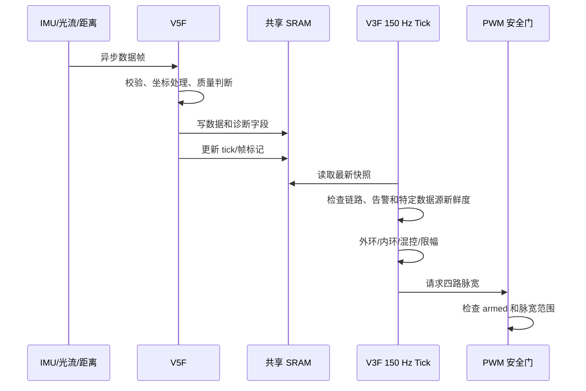

# 架构设计

本文解释当前代码为什么采用双核拆分、固定周期控制和共享内存通信，并同时记录这一原型架构的已知技术债。

## 设计目标

飞控软件同时面对两类工作负载：

- 姿态控制和电机输出需要稳定、可预测的执行周期。
- 串口解析、光流、距离、遥控和遥测具有不同的数据到达节奏，执行时间也更不稳定。

因此，本项目将最终控制权集中在 V3F，将采集和链路维护放在 V5F。拆分的目的不是追求复杂度，而是避免慢外设和通信路径直接扰动飞控节拍。

## 双核职责

| 核心 | 主要职责 | 不应承担的职责 |
| --- | --- | --- |
| V3F | 解锁/停机决策、姿态控制、混控、PWM、VOFA 控制侧遥测 | 不直接承担全部传感器协议解析 |
| V5F | IMU、光流、距离、NRF 遥控、状态诊断、共享数据发布 | 不直接决定或写入最终电机 PWM |

这一边界保证即使 V5F 的某个传感器驱动异常，电机输出仍须经过 V3F 的状态机和 PWM 安全门。

## 主要数据流



共享数据位于固定地址 `0x20140000`。V3F 与 V5F 各自保留一份 `shared_data.h`，因此结构体字段、顺序、对齐和语义必须同步修改。`volatile` 只能防止编译器省略访问，并不能自动解决多字段原子快照或缓存一致性问题。

当前实现不是一个统一的快照协议：TOF 使用 clear marker、memory fence、payload、commit marker 和 V3F 读侧双检；光流/XYKF 使用各自 marker/超时，但没有等价的完整快照；generic `update_tick` 只是 V5F 主循环心跳。更成熟的实现可以为每组 payload 建立有界序列锁或双缓冲，并明确 stale 后的控制策略。

## 控制调度

- TIM2 以约 150 Hz 触发 V3F 控制 tick，周期约为 6.667 ms。
- Roll/Pitch 姿态外环每两个 tick 执行一次，即约 75 Hz。
- 角速度内环每个 tick 执行一次，即约 150 Hz。
- 高度原型中的位置环和速度环进一步分频运行。
- V5F 使用基于 1 ms tick 的非阻塞主循环维护多个传感器与通信任务。当前 SysTick1 初始化属于赛后构建修复，尚未上板或飞行验证。

从阻塞式主循环迁移到定时节拍后，PID 的 `dt` 不再直接受打印和协议处理耗时影响。但是当前版本仍在 ISR 路径执行较多控制计算，且缺少系统化的最坏执行时间测量。这是明确保留的技术债。

## 控制链路

```text
遥控/位置速度目标
        ↓
姿态目标 Roll/Pitch/Yaw
        ↓  75 Hz
姿态外环：角度误差 → 角速度目标
        ↓  150 Hz
角速度内环：角速度误差 → 三轴修正量
        ↓
总距 + Roll/Pitch/Yaw 修正
        ↓
X 型四旋翼混控、饱和处理和安全限幅
        ↓
PWM armed 门控 → 四路 ESC
```

光流和高度控制不是独立于姿态控制的“旁路”，而是生成姿态目标或总距修正，并继续经过下游限幅和安全门。

## 为什么没有使用 RTOS

项目阶段的任务数量有限，且最关键需求是明确控制节拍与安全输出边界。双核、定时器和轻量 tick 调度足以表达当前任务关系，引入 RTOS 会增加调度、栈配置和调试成本。

如果继续迭代，RTOS 并非必然目标。应先测量任务执行时间、抖动和阻塞来源，再决定是否需要抢占式调度。对于控制核，也可以保留定时触发的单一高优先级控制任务。

## 已知技术债

- V3F `main.c` 仍集中了承担命令、模式、控制和遥测协调的较多职责。
- 完整控制计算直接运行在定时器 ISR 中，缺少 WCET 和中断占用率证据。
- V3F/V5F 仍各自复制共享结构定义；赛后脚本可检测字段漂移，但还不是单一来源生成。
- 除 TOF 外，跨核多字段读取没有完整的快照一致性协议。
- 已增加 WCH GCC 的命令行双核构建脚本，但仍依赖 Windows/MounRiver 工具链，尚无 CI 和固定容器镜像。

如果启动下一版，优先级应是建立可测量的任务时序、生成单一共享协议头、拆分控制状态机与命令解析，而不是继续增加功能。
