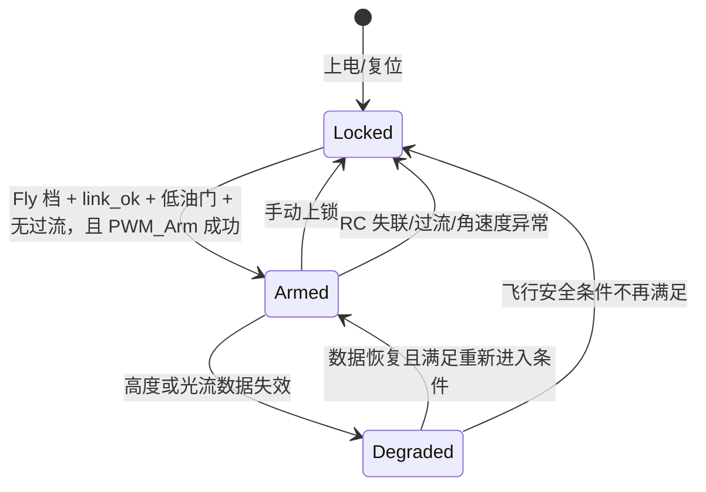

# 安全设计

本文描述当前代码中与电机输出相关的安全边界。它是设计说明，不是适航、安全认证或硬件测试授权。

## 基本原则

1. 上电默认安全：初始化完成不等于允许电机旋转。
2. 最终控制权单一：V3F 决定是否输出，V5F 只提供数据和告警。
3. 多层拒绝非法输出：业务状态机检查一次，PWM 模块仍需独立门控和限幅。
4. 数据失效应有明确行为：冻结、降级或停机；当前源码只在部分数据路径做到这一点。
5. 紧急停机优先于平滑体验：普通降速可以渐变，危险状态直接走锁定路径。

## 输出安全链

实际代码包含多个模式和测试分支，上图只表达安全主线。

## 主要防护

### PWM 默认锁定

`PWM_Init()` 后保持最小脉宽，`PWM_SetPulseUs()` 与四路批量输出接口都会检查 armed 状态。业务代码即使错误地产生了较高脉宽，也不应绕过 PWM 层直接写比较寄存器。

### 解锁前置条件

当前解锁需要 Fly 档、`rc_link_ok=1`、低油门、无 V307 overcurrent，且 PWM 模块要求四路缓存均处于最小值。当前 `PWM_Arm()` **没有 3 s 阻塞等待**；旧注释中的 arm delay 并非实际功能。

### RC 失联

V5F 在一段时间未收到合法遥控包后清除 `rc_link_ok`；V3F 读取该状态并执行最终保护。当前超时阈值为代码中的 500 ms 配置。

这一机制仍依赖 V5F 正常运行和共享数据可见。更完整的系统还应考虑 V3F 侧独立检测共享更新计数停止，以及硬件看门狗复位策略。

### 角速度异常

控制 tick 检查过大的陀螺角速度，以覆盖混控方向、传感器异常或闭环快速发散等高风险情况。触发后应优先锁定 PWM、清理 armed 状态和控制器内部状态。

### 过流告警（当前有开放 P0 问题）

通信链路解析过流标签并将其作为 V3F 强制停机条件。但是 `V307_AlarmPoll()` 对 `0xBB + 4-byte payload` 只跳过了 3 个 payload 字节，最后一个 payload byte 可能被误识别为 `0xCC/0xDD`。因为修复会改变 failsafe 行为，本轮只报告，没有直接修改。该问题关闭并完成字节流/硬件测试前，不能声称过流链路可靠。

### IMU/V5F 停更（当前缺口）

V3F 会观察 generic `update_tick` 最近变化时间并放入 VOFA snapshot，但该时间没有参与 armed 保持条件。控制 tick 直接使用共享姿态/角速度，因此 V5F 或 IMU 停更时，当前代码没有通用的 stale freeze/degrade/disarm 策略。新增此策略属于 failsafe 行为改变，需要先定义独立 IMU sequence/timestamp 并完成拆桨故障注入。

### 传感器失效与控制降级

- 距离数据短时冻结时暂停高度积分，避免旧误差持续积累。
- 距离数据超时后标记高度估计无效，高度控制进入降级或退出路径。
- 光流低质量、距离无效、数据超时或来源不匹配时，不应继续使用其位置/速度输出。
- 从无效恢复时重新捕获目标或进行平滑接入，避免控制量跳变。

## 测试模式约束

单电机和固定油门模式用于拆桨台架调试，不属于正常飞行路径。测试模式应满足：

- 其余电机保持最小输出；
- 仍然受 PWM 上限和 armed 门控约束；
- 紧急停机可以立即抢占测试模式；
- 退出、上锁或故障后清除暂态配置。

## 硬件测试边界

- 烧录、首次上电、单电机测试和四电机怠速测试必须拆桨。
- 先使用限流电源或可靠的电流观测方式，再接入高放电倍率电池。
- 出现意外启动、堵转、失步、温升、复位、异味或电流突增应立即断电。
- 装桨测试应有独立的机械约束、隔离距离和人工急停方案。
- 未完成故障注入与长时间测试前，不应把软件保护视为唯一安全措施。

## 未完成的安全验证

- 未证明所有强制停机路径的最大响应时间。
- 未进行系统化的传感器断线、脏帧、共享内存停更和核间异常注入。
- 未完成 PWM 输出的示波器全状态验证记录。
- 未完成长时间运行、供电跌落、电磁干扰和看门狗恢复测试。
- 比赛时期整机做过飞行测试，但没有完成带桨全工况、长时间和当前 HEAD 对应的复验。

因此，仓库中“已实现保护逻辑”不能等同于“系统已通过安全验证”。
